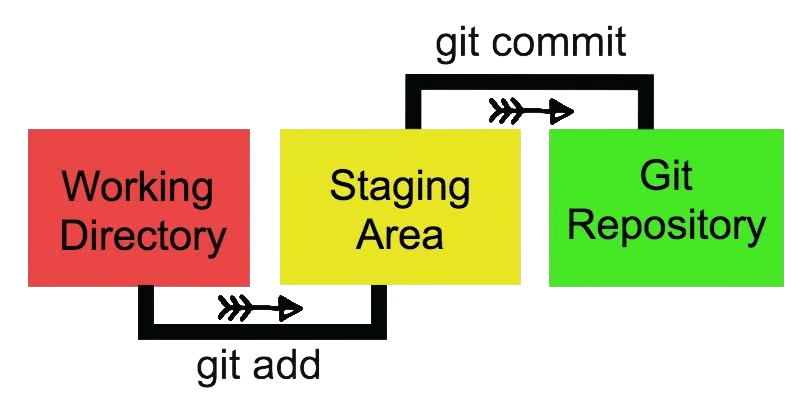

<div>
# GIT-GITHUB
> Curso de Git y Github

> <font color="#5eff00ff"> COMANDOS PARA REALIZAR LA CONFIGURACION INICIAL DE GIT</font>
- git es un controlador de versiones

```
 git config --global user.email "email"
```
- Se utiliza para setear el correo electronico de la cuenta de git

```
 git config --global user.name "username"
```
- Se utiliza para setear el usuario de la cuenta de git

```
 git remote set-url origin URL
```
-  Renombra `URL` del repositorio o Actualiza conexion

``` 
 git remote add origin URL
```
- Conecta tu repositorio local al repositorio remoto

```
 git config --global -l
```
- verificar las credenciales seteadas a git
    - [x] UserName
    - [x] Email

```
git config --list 
```
- Muestra todas los valores de las credenciales seteadas en git
    - :eye: Para salir utilizar la tecla q **`(q)`**

<BR>

---

<BR>
<BR>

> # SUBIR CAMBIOS A GIT A GITHUB #
> <font color="#5eff00ff"> COMANDOS PARA SUBIR CAMBIOS DEL RESPOSITORIO LOCAL AL REMOTO</font>

```
git clone URL
```
- Sirve para clonar clonar el repositorio de `Github` **(Repositorio remoto)**

```
git pull origin branch(main)
```
- Actualiza el repositorio local, con todos los cambios realizados por el usuario o otros usuarios

```
 git status
```
- Verificar estado del repositorio incluyendo archivos modificados y que estan listos para el commit
- 👁️ En caso los archivos no esten se veran **`color rojo`** y cuando esten listos seran **`color verde`**

```
git add . o git add --all
```
- Cargar todos los cambios de archivos nuevos o modificados al repositorio local

```
git commit -m "message"
```
- Guarda y confirma los cambios al repositirio local

```
 git push origin branch
```
- Envia los cambios ya confirmados de la rama local al repositorio remoto

```
 git rebase
```
- Si has estado trabajando en una rama y la rama principal ha avanzado, puedes usar rebase para incorporar los últimos cambios a tu rama. 



> #### Estamos en la etapa de **`working directory`**, antes de hacer **`git add .`**
```
 git clean -f
```
- Sirve para eliminar cambios de archivos no trakeados 
- No Trakeado es un archivo nuevo que no ha tenido commits
    - **-`f`** ==> Sirve para forzar la eliminacion 
    - **-`n`** ==> Sirve para saber que elemento se van a eliminar

> #### Estamos en la etapa de **`staging area`**, desde de hacer **`git add .`**
```
 git reset HEAD archivo
```
- Sirve para deshacer cambios que ya han sido traqueados, y se han subido al staging Area con el comando **`git add .`**

> #### Estamos en la etapa de **`git repository`**, desde de hacer **`git commit -m "message"`**
```
 git revert commit
```
- Sirve para deshacer que han sido traqueado y subidos al **`stage area`**, a los cuales se le realizo el **`git commit -m "message"`**
